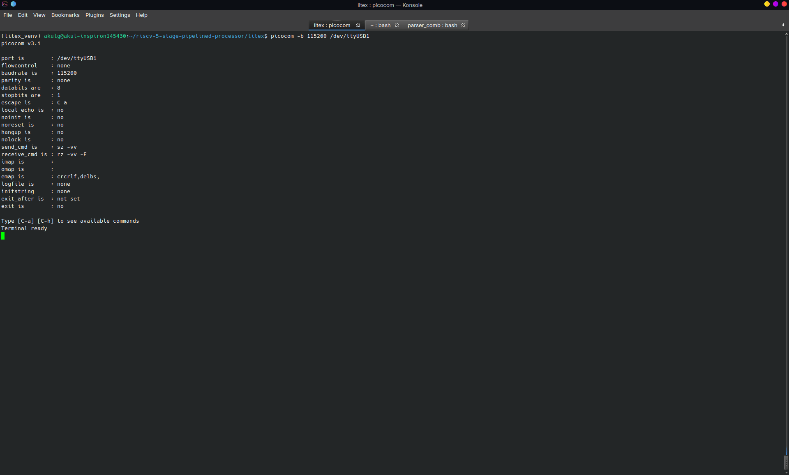

# RISC-V 5-Stage Pipelined Processor

This repository contains a custom 32-bit RISC-V (RV32I) processor implemented in SystemVerilog. It features a classic 5-stage pipeline (Fetch, Decode, Execute, Memory, Writeback) and is built to support two different memory interconnect architectures: a Tightly Coupled Memory (TCM) and a standard Wishbone bus.

The processor is almost completely compliant with the **RV32I** ISA, with the expection of the `EBREAK`, `ECALL` and `FENCE` instructions.

## Architectures: TCM vs. Wishbone

A primary design goal of this processor is to decouple the core datapath from the memory interface. The repository includes two distinct versions of the processor to evaluate the impacts of memory latency:

- **Tightly Coupled Memory (TCM)**: This version connects the processor directly to the instruction and data memory. Memory access completes in a single cycle without any bus stalls, making it simpler and faster. This serves as the baseline architecture for the processor. Since BRAM is synchronous, I used the BRAM itself as sort of a pipeline register for the instruction/read data. 
- **Wishbone SoC**: This version uses a standard Wishbone bus interconnect to communicate with memory. Because Wishbone transactions take multiple cycles to complete via handshaking, this configuration introduces pipeline stalls, forcing the processor to wait for memory responses. This is a realistic representation of System-on-Chip (SoC) integration.

## Verification & Testing

An automated testing script is provided using **Verilator**, **Python**, and **Make**.

The `tests/` directory contains various bare-metal assembly programs along with JSON configuration files. These JSON files define the expected final register and memory states after a program finishes execution. The `run_test.py` script automatically cross-compiles the assembly using the RISC-V toolchain, runs the Verilator simulation, and asserts that the actual state matches the expected JSON values.

The **Mega Testbench** (`sim/tb_mega.sv`) instantiates both the TCM and Wishbone processors and runs them in parallel. Even though the Wishbone version takes more clock cycles to finish execution due to bus stalls, the testbench monitors both and ensures that their final architectural states (registers and data memory) match perfectly. 

To run the tests:
- `make sim`: Compiles and runs submodule-level unit tests (ALU, control unit, branch logic, etc.) to ensure individual hardware components are functioning before system-level integration.
- `make verify`: Runs the test suite on the TCM baseline version.
- `make verify_wb`: Runs the test suite on the Wishbone version.
- `make verify_mega`: Runs the comparative dual-core verification testbench.
- `make verify_all`: Runs all test suites.

## FPGA Integration (LiteX)

The processor is designed to be fully synthesizable. The `litex/` directory contains the Python integration scripts necessary to deploy the Wishbone version of the core onto a **Digilent Basys 3 FPGA** using the LiteX framework.

To build the SoC bitstream:
1. Ensure the LiteX environment and Xilinx Vivado toolchain are installed and properly sourced.
2. Navigate to the `litex/` directory: `cd litex`
3. Run the build script: `python3 basys3_soc.py`

This will bundle the RISC-V processor, memory, and UART peripherals, synthesize the hardware, and generate the bitstream in `litex/build/basys3/`.

*A demonstration of the processor executing firmware and communicating over UART on the FPGA. The text entered on the keyboard was "abcdABCD0123456789", the transformation was done by the processor*

## Directory Structure

- `rtl/core/`: SystemVerilog source files for the core 5-stage pipeline (ALU, control unit, forwarding, hazard detection, etc.).
- `rtl/tcm/` & `rtl/mem/tcm/`: Top-level wrappers and simulated single-cycle memory for the TCM architecture.
- `rtl/wishbone/` & `rtl/mem/wishbone/`: Top-level wrappers and bus interfaces for the Wishbone SoC architecture.
- `sim/`: Verilator testbenches. Includes unit tests for submodules and the top-level tests (`tb_top_tcm.sv`, `tb_wb.sv`, `tb_mega.sv`).
- `litex/`: Scripts and wrappers for generating a Basys 3 FPGA System-on-Chip using LiteX.
- `tests/`: Assembly test programs and their expected outcome JSON files.
- `firmware/`: Linker script and boot code (`crt0.S`) for bare-metal execution.
- `run_test.py`: Python script for orchestrating compilation, simulation, and output parsing.
- `Makefile`: Build system to easily compile code and run tests.

## Dependencies

- **Verilator**: To compile the SystemVerilog hardware into fast C++ simulation models.
- **RISC-V GNU Toolchain** (`riscv64-unknown-elf-*`): To cross-compile the assembly tests into machine code.
- **Python 3**: For the test automation script.
- **LiteX**, **Xilinx Vivado**: To synthesize the LiteX integration.
